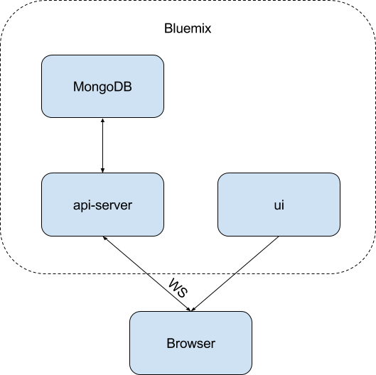

### Architecture

# IoT Simulator

Application simulate sending data from device to cloud and visualize recent measurements on ui.
It uses Compose for MongoDB service to store measurements.

## Prerequisites
* Git
* Node.js 4.x or higher with NPM 3.x or higher
* Bluemix account

## First steps
* Clone the repo `git clone https://github.com/Altoros/iot-simulator.git`
* Repository contains completed application at `master` branch.
* Open a `./iot-simulator` in your code editor

## Run locally
* Using the command line, navigate to the `./iot-simulator-api` directory and install dependencies with `npm install`
* Navigate to Bluemix Catalog and create `Compose for MongoDB` service: https://console.ng.bluemix.net/catalog/services/compose-for-mongodb
* Open the *Service Credentials* tab and click on *View Credentials*. Copy the contents and modify `MONGODB_URL` in `./iot-simulator-api/.env`
* Run the development server with `npm run dev`
* In second terminal window navigate to the `iot-simulator-ui` directory and install dependencies with `npm install`
* Run the development server with `npm run dev`. That should automatically launch the default web browser

## Build and deploy
* Stop `iot-simulator-api` using hotkey Ctrl+C.
* Pause for the discussion on build artifacts. Create a build artifact for deployment with `npm run build`. Observe the contents of `./iot-simulator-api/dist` directory
* Update `host` in a `./iot-simulator-api/manifest.yml` file
* Pause for the discussion on manifest.
* Finally, deploy the application using the command line: `cf push`. Observe the command line output for a URL of the deployed app
* Modify `./iot-simulator-ui/config/prod.env.js` with the URL of the deployed API
* In second terminal window rebuild and deploy the `iot-simulator-ui` with `npm run build` and `cf push`
* Edit `host` in a `./iot-simulator-ui/manifest.yml` file.
* Finally, deploy the application using the command line: `cf push`
* Open the URL of deployed `iot-simulator-ui` and try to add new measurements. Check both HTTP and HTTPS access.
* Pause for the discussion on logs. Print the logs of the application with `cf logs --recent iot-simulator-api`

## Additional exercises
* Bind Compose for MongoDB service to `iot-simulator-api` using Bluemix UI or CF CLI and modify `./iot-simulator-api/src/config.js` to receive `MONGODB_URL` from `process.env.VCAP_SERVICES`
